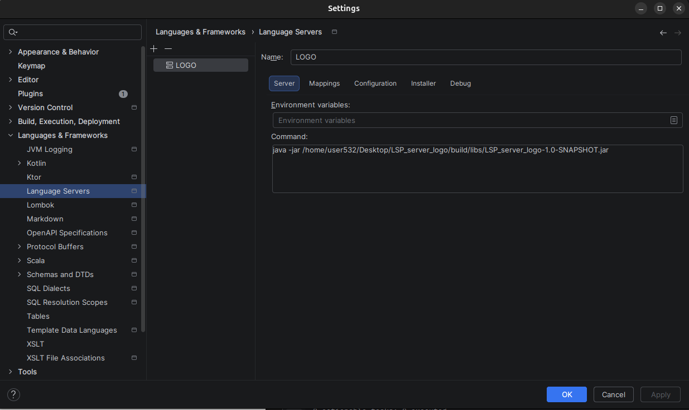
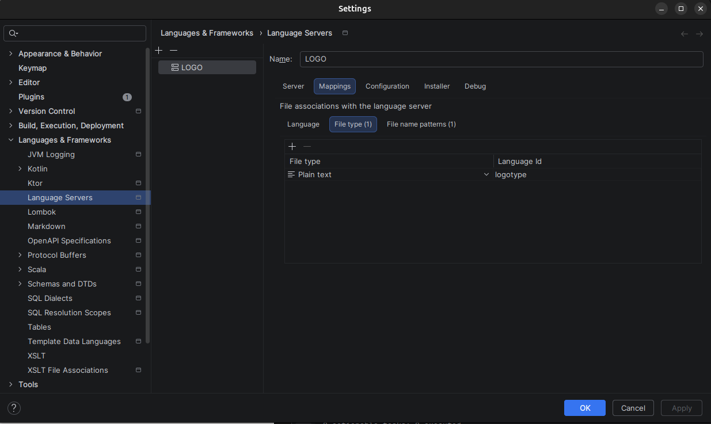
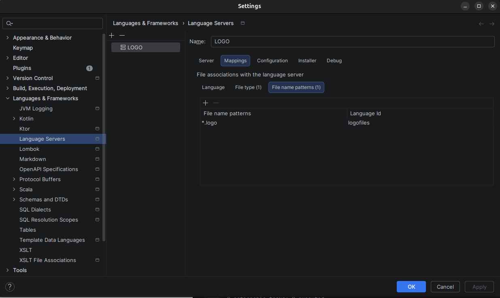
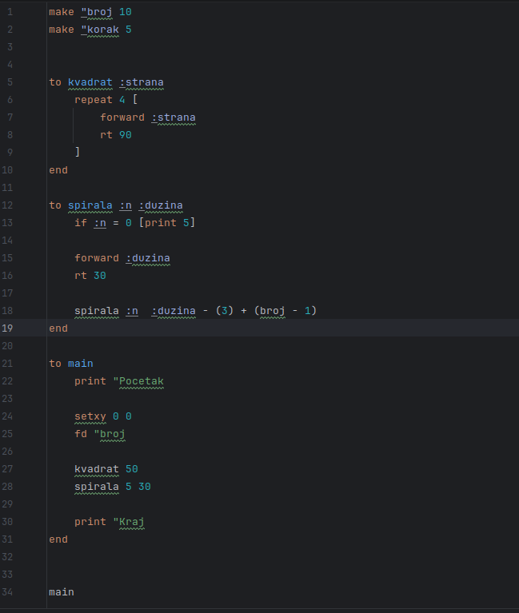
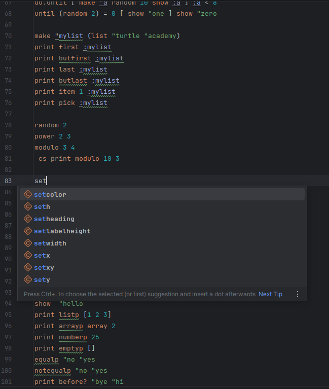

# Logo Language Server Protocol

## Overview

This project provides an implementation of a Language Server Protocol (LSP) server for the **LOGO programming language**.  
It enables modern IDE features in editors that support LSP.

## Features

- **Syntax highlighting** for all language constructs
- **Go to declaration** for procedures and variables
- **Hover support** – displays documentation and usage examples for keywords
- **Autocomplete** suggestions

---


## Setup and Build Instructions

### Clone repository
You can clone the project using either SSH or HTTPS:
#### ssh
```bash
git clone git@github.com:nikolinasobic/LSP_server_logo.git
```
#### https
```bash
git clone https://github.com/nikolinasobic/LSP_server_logo.git
```

```bash
cd LSP_server_logo
```

### Build the Project
```bash
./gradlew build
```

After the build completes, the .jar file will be generated in:

build/libs

## Intelij IDEA Integration

### Instal LSP Support

To use this server in IntelliJ IDEA, install the LSP4IJ plugin:

1. Go to: Settings → Plugins
2. Search for: LSP4IJ
3. Install and enable the plugin
4. Restart the IDE

## Configure the Language Server

Navigate to:

Settings → Languages & Frameworks → Language Servers
1. click "+" to add a new server
   
2. Set the following:
- Name: LOGO (or any preffered name)
- Command:
  `java -jar /path/to/server.jar`
The .jar file is located in:
<project-root>/build/libs/
To copy the absolute path in Intelij:
- Right-click the .jar file
- Select Copy Path/Reference->Absolute Path
3. Configure
- File type

- File name patterns (*.logo)

4. Apply changes and restart IDEA

## Usage

After completing the setup:
- Open any .logo file in IntelliJ IDEA
- The language server should automatically activate
- Features like syntax highlighting, hover, autocomplete, and navigation will be available



